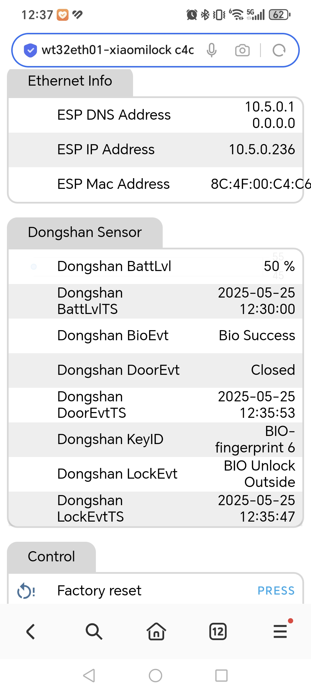

# ESPHOME的external components
---
## xiaomi_lock
蓝牙BLE获取小米智能门锁的状态，需要mac地址和bindkey，具体获得方法请访问bbs.hassbian.com  
     
yaml格式：
```
external_components:
  - source:
      type: git
      url: https://github.com/yuxudong/esphome_custom_components
    components: [ xiaomi_lock ]
sensor:
  - platform: xiaomi_lock
    id: dongshan
    mac_address: 'xx:xx:xx:xx:xx:xx'
    bindkey: '000102030405060708090a0b0c0d0e0f'
    lockevt:
      name: "Dongshan LockEvt"
    lockevtts:
      name: "Dongshan LockEvtTS"
    doorevt:
      name: "Dongshan DoorEvt"
    doorevtts:
      name: "Dongshan DoorEvtTS"
    battlvl:
      name: "Dongshan BatteryLevel"
    battlvlts:
      name: "Dongshan BatteryLevelTS"
    bioevt:
      name: "Dongshan BIOEvent"
    keyid:
      name: "KeyID"
```

## tds
购自https://item.taobao.com/item.htm?id=611035894936 指令见宝贝详情    
声明本人与该模块无任何商业联系，存在自己需要买了模块然后写了esphome的组件    
yaml格式：    
```    
external_components:
  - source:
      type: git
      url: https://github.com/yuxudong/esphome_custom_components
    components: [ tds ] 
sensor:
  - platform: tds
    send_interval: 1000000
    inputTemperature:
      name: "input Temperature"
    outputTemperature:
      name: "output Temperature"
    inputTDS:
      name: "input TDS"
    outputTDS:
      name: "output TDS"

```    
    
